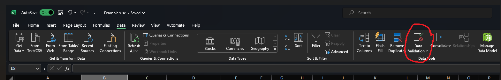
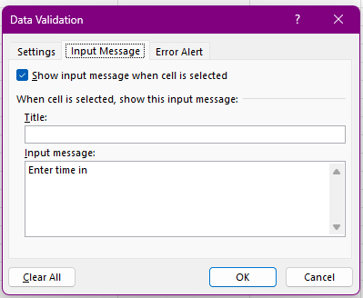

# Data Validation in Microsoft Excel

### *What is Data Validation?*

Data Validation is a tool within Excel that allows the user to predetermine what types of data can be entered into a cell. For example, the user could lock a set of cells to only allow whole numbers to be entered, or to only allow dates to be entered. 

### *Why is Data Validation useful?*

Using data validation can reduce errors when filling in spreadsheets by making sure the user only inputs the intended form of data. For example, 30 instead of thirty. It can also increase productivity by offering the user direct access to a few allowed inputs instead of making them remember and manually input them. 

### *How do you use it?*

Assuming you know how to create an excel spreadsheet, using data validation is simple. In my example, we will use an employee timesheet template. 

1) Select a range of cells to have data validation applied to
.png)
2) Select "Data Validation" in the top right of the ribbon, under the "Data" tab

3) Select the relevant criteria in the "Allow" dropdown of the "Settings" tab in the resulting window
In this case, we will be using "Time" as the type of data allowed. 
.png)
4) Choose your criteria from the "Data" dropdown.
We will be using "Between" as the modifier.
.png)
5) When using "Time" and "Between" as the validation criteria, the user must input a "Start" and "End" time for the formula to use. In our example, we are only going to allow employees to clock in between 6 a.m. and 6 p.m.
.png)
6) After setting up our validation formula, we can make additional changes to an input message and an error message. We can do so by selecting "Input message" from the top menu in the data validation window. In this case, I entered "Enter time in" as the message displayed to the user when they select the cell. 

7) 

### *Data*
