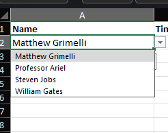

# Data Validation in Microsoft Excel

### *What is Data Validation?*

Data Validation is a tool within Excel that allows the user to predetermine what types of data can be entered into a cell. For example, the user could lock a set of cells to only allow whole numbers to be entered, or to only allow dates within a certain range to be entered. 

### *Why is Data Validation useful?*

Using data validation can reduce errors when filling in spreadsheets by making sure the user only inputs the intended form of data. For example, 30 instead of thirty. It can also increase productivity by offering the user direct access to a few allowed inputs instead of making them remember and manually input them. 

### *How do you use it?*

Assuming you know how to create an excel spreadsheet, using data validation is simple. In my example, we will use an employee timesheet template. 

1) Select a range of cells to have data validation applied to

.png)

2) Select "Data Validation" in the top right of the ribbon, under the "Data" tab

3) Select the relevant criteria in the "Allow" dropdown of the "Settings" tab in the resulting window. In this case, we will be using "Time" as the type of data allowed. 

.png)

4) Choose your criteria from the "Data" dropdown.
We will be using "Between" as the modifier.

.png)

5) When using "Time" and "Between" as the validation criteria, the user must input a "Start" and "End" time for the formula to use. In our example, we are only going to allow employees to clock in between 6 a.m. and 6 p.m.

.png)

6) After setting up our validation formula, we can make additional changes to an input message and an error message. We can do so by selecting "Input message" from the top menu in the data validation window. In this case, I entered "Enter time in" as the message displayed to the user when they select the cell. 

7) In the "Error Alert" section, you can change the error message that pops up when a user enters in an invalid entry. I chose to tell the user "Invalid time input" in my error message. 

.png)

8) In this image, we can see that I attempted to enter 5:30 as the time in. Since this is outside our allowed range of times, the error message pops up letting me know that. 

.png)

9) However, in this image we can see that entering 6:01 allows me to move on to the next cell. We can also see the input message displayed, prompting what information should be entered into the cell. 

.png)

10) Next I'll show you how to use the "List" criteria for data validation. First, we need to create a relevant list contained somewhere within the spreadsheet. In this example, I'm going to stack our company with some stellar employees. 

.png)

11) Then, as we already know, we'll select a set of cells to apply the data validation to.

.png)

12) By selecting "List" from the "Allow" dropdown, we can choose a list of values to be allowed in our set of cells. 

.png)

13) Next, we can chose the "Source" for the list, which is our list we created earlier. We do this by selecting the entry box for source, and then highlighting our created list on the spreadsheet, which will fill in that dialogue for us.

.png)

14) I also entered in input and error messages, but we've already seen how that is done. Since the "in-cell dropdown" checkbox was already checked in the settings page by default, then there will be a handy dropdown for the user to select values from for each of the relevant cells. 

### *Data*

This has been a brief tutorial on how to use the Data Validation tool within Microsoft Excel. Below you will find the spreadsheet I used in the tutorial, along with some additional examples not covered above. Feel free to play around with the different settings and options, and create some of your own data validation formulae. 

